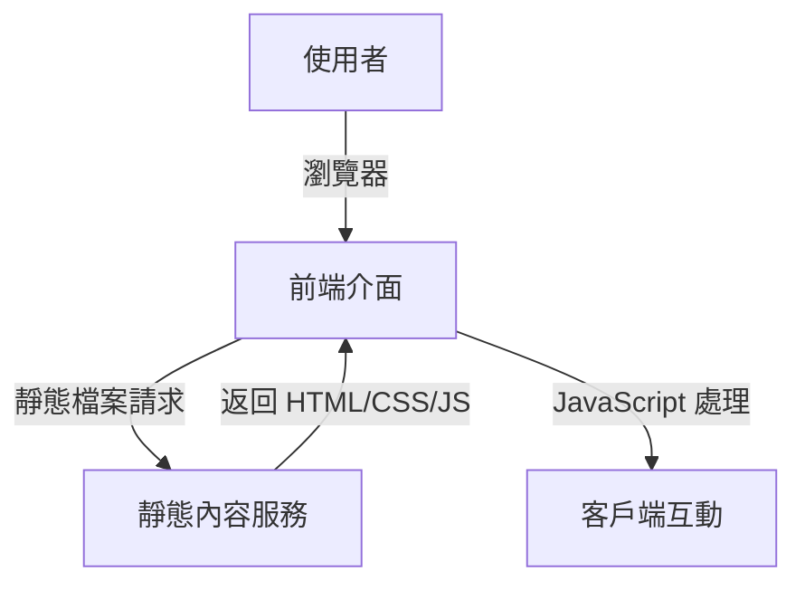
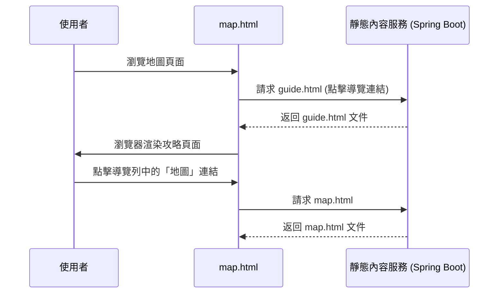

這是一份根據您的需求規格書（REQ.md）設計並修正後的**系統架構書（SA.md）**。

這份 SA 嚴格遵循了您的 **15 小時純靜態原型**的要求，排除了所有後端、API 和資料庫組件，將架構重點集中在前端頁面和靜態內容服務上,。

---

# 系統架構書 (SA.md) – 遊戲攻略靜態原型

### 1. 使用案例對應 (Use Case Mapping)

本架構旨在支援 REQ 文件中定義的三個核心 MVP 功能。這確保了架構設計不會遺漏任何需求,。

| REQ 編號 | 使用案例 (Use Case) | 參與角色 | 對應 SA 模組/頁面 |
| :--- | :--- | :--- | :--- |
| F-01 | 簡化版互動地圖 | 迷路的探索者 | 前台 - `map.html` |
| F-02 | 靜態圖文攻略 | 新手登山客 | 前台 - `guide.html` |
| F-03 | 基礎頁面導覽 | 所有使用者 | 前台 - 導覽列 (`index.html`) |

### 2. 系統分層概觀 (System Layer Overview)

本系統採用**極度簡化**的兩層架構，以確保在 15 小時內的可行性,。標準的後端分層（Service/Repository/DB）已被排除,。

*   **前端展示層 (Presentation Layer)**：負責顯示所有靜態內容（HTML/CSS/JS），處理所有客戶端互動（例如地圖點擊彈窗）。
*   **靜態內容服務層 (Static Content Service Layer)**：由 Spring Boot 容器提供，僅作為 Web Server，負責將靜態檔案提供給瀏覽器。
*   **後端系統層 / 資料層**：**無 (Out of Scope)**。

> **資料流向說明**：使用者操作 WebUI $\rightarrow$ 發送 HTTP 請求至靜態內容服務層 $\rightarrow$ 瀏覽器接收並渲染靜態檔案 $\rightarrow$ 瀏覽器執行 JavaScript 進行互動。

### 3. 頁面架構列表 (Page Architecture) —— ⭐ 最重要

這是 Gemini CLI 生成專案骨架的關鍵依據,。本系統使用**獨立的 HTML 檔案**實現導覽切換。

#### 3.1 前台頁面 (Frontend Pages)

| 頁面名稱/路徑 | 頁面主要功能/按鈕 |
| :--- | :--- |
| **首頁 (`/index.html` 或 `/`)** | 網站主入口，提供導覽列。 |
| **地圖頁 (`/map.html`)** | 顯示固定地圖圖片，包含 2-3 個可點擊的靜態圖標。 |
| **攻略頁 (`/guide.html`)** | 顯示第一個任務的靜態文字和圖片攻略。 |

#### 3.2 後台頁面 (Backend Pages)

**無** (Out of Scope)。

### 4. 系統架構圖 (System Architecture Diagram)

使用 Mermaid 語法呈現高階分層結構（符合規範,,）：

### 5. 使用者情境順序圖 (User Sequence Diagram)

針對 REQ 的核心 MVP 功能（基礎頁面導覽）繪製業務流程圖。重點是動線，不寫程式碼細節,。

**情境：基礎頁面導覽切換 (Map $\rightarrow$ Guide)**

