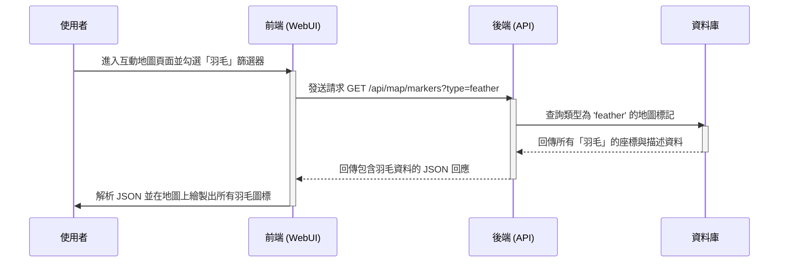

# 系統架構文件

## 1. 系統概覽 / Overview / 개요
本網站分為三層結構：
*   **前端 (Frontend):** (使用 React/Vue/Svelte 或純 HTML/CSS/JS) 負責顯示地圖、攻略內容、篩選器，並處理所有使用者互動。
*   **後端 (Backend API):** (使用 Node.js/Python/Go 或 Spring Boot) 負責處理前端的資料請求，並從資料層撈取對應的遊戲資料。
*   **資料層 (Data Layer):** (使用 MongoDB/PostgreSQL 或 JSON 檔案) 儲存所有地圖標記、攀登路線、收集品位置與攻略圖文。

## 2. 模組設計 / Module Design / 모듈 설계
| 模組 | 功能 | 負責人 |
| :--- | :--- | :--- |
| WebUI (前端) | 渲染互動地圖、攻略頁面、搜尋框與篩選器。 | Alice |
| Map API (後端) | 提供地圖標記 (Markers) 與圖磚 (Tiles) 資料。 | Bob |
| Guide API (後端) | 提供主線攻略、收集品位置的文字與圖片資料。 | Bob |
| Database (資料層) | 儲存所有地圖座標、攻略步驟、物品描述等資料。 | Carol |

## 3. API 表格 / API Table / API 표
| Path | Method | Request | Response |
| :--- | :--- | :--- | :--- |
| `/api/map/markers` | GET | `?type=collectible` (可選篩選) | 地圖標記清單 (JSON) |
| `/api/guides/main` | GET | - | 主線登頂攻略 (JSON/HTML) |
| `/api/guides/collectibles` | GET | `?id=feather_01` (可選) | 全收集品清單或特定項目 (JSON) |
| `/api/search` | GET | `?q=隱藏洞穴` | 搜尋結果列表 (JSON) |

## 4. 資料流 / Data Flow / 데이터 흐름
**[範例：使用者篩選地圖]**
1.  **使用者** 在「前端頁面」上勾選「顯示所有羽毛」。
2.  **前端** 發送一個 `GET /api/map/markers?type=feather` 請求給「後端 API」。
3.  **後端 API** 收到請求，向「資料庫」查詢所有 `type` 為 `feather` 的座標資料。
4.  **資料庫** 回傳資料給「後端 API」。
5.  **後端 API** 將資料打包成 JSON 格式，回傳給「前端」。
6.  **前端** 接收到 JSON，並在地圖上繪製出所有羽毛圖標。

## 5. 非功能性需求 / Non-functional Req / 비기능 요구사항
*   **效能 (Performance):** 互動地圖的標記與圖磚載入時間必須在 2 秒內完成。
*   **安全性 (Security):** 搜尋框需有基本的輸入驗證，防止 XSS (跨站腳本攻擊)。
*   **擴充性 (Scalability):** API 與資料庫設計應模組化，以便未來遊戲推出 DLC (新地圖、新收集品) 時能快速擴充。
*   **可用性 (Usability):** 網站必須採用響應式設計 (RWD)，確保在電腦和手機瀏覽器上皆可正常操作。

---

## 6. 使用者故事 / User Stories / 사용자 요구사항
這份文件通常會用「As a [使用者類型], I want [某個功能], so that [達成某個目的]」的格式來撰寫，以確保團隊成員都理解開發每項功能的「原因」。

### 🎯 主要使用者：新手登山客
*   **As a** 新手登山客,
    **I want** 一個「主線登頂路線」的圖文攻略,
    **so that** 我可以一步步跟著走，不會在廣大的地圖中迷路。

*   **As a** 新手登山客,
    **I want** 了解「耐力值」和「天氣」系統是如何運作的,
    **so that** 我不會因為耐力耗盡而從懸崖上掉下來。

### 🎯 主要使用者：迷路的探索者
*   **As a** 迷路的探索者,
    **I want** 一個強大的「搜尋功能」,
    **so that** 我可以立刻輸入我所在區域的名稱（例如：「雪山隘口」），並找到相關的路線指引。

*   **As a** 迷路的探索者,
    **I want** 一張「互動地圖」,
    **so that** 我可以放大查看，並找到附近是否有「捷徑」或「休息點」。

### 🎯 主要使用者：完美主義收藏家
*   **As a** 完美主義收藏家,
    **I want** 在互動地圖上「篩選」特定類型的收集品（例如：只顯示羽毛）,
    **so that** 我可以有效率地規劃我的收集路線。

*   **As a** 完美主義收藏家,
    **I want** 一個「全收集品列表」，並且可以「打勾標記」我已經找到的項目,
    **so that** 我可以追蹤我的收集進度，確保沒有遺漏。

## 7. 資料流程圖 / Data Flow Diagram (DFD) / 데이터 플로우 다이어그램
我們以一個最核心的流程為例：「使用者查詢特定收集品位置」。

### DFD - 循序圖

### DFD - 流程文字描述
1.  **[使用者]** 進入攻略站的「互動地圖」頁面。
2.  **[使用者]** 在「篩選器」中勾選了「羽毛 (Feather)」。
3.  **[前端 (WebUI)]** 偵測到使用者的操作，立即向「後端 (API)」發送一個 `GET /api/map/markers?type=feather` 的資料請求 (Request)。
4.  **[後端 (API)]** 接收到請求，解析出 `type=feather` 的參數。
5.  **[後端 (API)]** 向「資料庫 (Database)」發出查詢指令 (Query)，要求取得所有「類型為羽毛」的資料。
6.  **[資料庫 (Database)]** 從「地圖標記資料表 (Markers Table)」中檢索所有符合條件的座標與描述資料 (Marker Data)。
7.  **[資料庫 (Database)]** 將這包「羽毛資料」回傳給「後端 (API)」。
8.  **[後端 (API)]** 將原始資料打包成標準的 JSON 格式。
9.  **[後端 (API)]** 將此 JSON 作為回應 (Response) 傳回給「前端 (WebUI)」。
10. **[前端 (WebUI)]** 接收到 JSON 資料，解析內容，並在地圖畫面上動態繪製出所有「羽毛」的圖標。
11. **[使用者]** 看到地圖上出現了所有羽毛的位置。

---

## 8. 系統架構問答 / System Architecture Q&A / 시스템 아키텍처 Q&A

#### Q1: 這個系統的主要「任務」是什麼？ (이 시스템의 주요 "임무"는 무엇인가요?)
**A:** 本系統的主要任務是為《Peak》遊戲玩家提供一個全面、易用的攻略網站。核心目標是透過「互動地圖」和「圖文攻略」，幫助玩家解決在遊戲中遇到的困難，例如尋找路線、收集物品，最終順利登頂並享受完整的遊戲體驗。

#### Q2: 如果你是使用者，會先看到什麼畫面？接著會做什麼？ (사용자라면 어떤 화면을 먼저 보게 되나요? 다음으로 무엇을 할 건가요?)
**A:**
1.  **先看到的畫面**: 我會先看到網站的「首頁」，上面最顯眼的就是《Peak》的「互動地圖」。地圖上可能已經預設顯示了一些主要地標。
2.  **接著會做的事**:
    *   **如果是為了找特定物品 (完美主義收藏家)**: 我會立刻尋找「篩選器」，勾選我想找的收集品（例如：「羽毛」），讓地圖只顯示它們的位置。
    *   **如果我迷路了 (迷路的探索者)**: 我會使用「搜尋框」，輸入我所在位置的名稱，希望能找到相關文章或地圖標記。
    *   **如果是剛加入遊戲 (新手登山客)**: 我會尋找「主線攻略」的連結，點進去閱讀圖文並茂的步驟教學。

#### Q3: 系統中有哪些資料需要被保存？由誰管理？ (시스템에 어떤 데이터가 저장되어야 하나요? 누가 관리하나요?)
**A:**
*   **需要被保存的資料**:
    *   地圖資料：地圖區域、地標、休息點、捷徑等的位置 (座標) 與描述。
    *   收集品資料：所有收集品（如羽毛、旗幟）的詳細位置、取得方式與描述。
    *   攻略資料：主線、支線任務的圖文攻略內容，包含每個步驟的說明與圖片。
*   **管理者**:
    *   這些資料最終都保存在「**資料層 (Database)**」中。
    *   根據職責劃分，**Carol (負責資料層)** 負責資料庫的結構設計與維護。而 **Bob (負責後端 API)** 則透過 API 邏輯來管理這些資料的讀取與寫入。

#### Q4: 哪些模組之間需要交換資料？ (어떤 모듈들 사이에 데이터 교환이 필요한가요?)
**A:**
*   **前端 (WebUI) ↔ 後端 (API)**: 這是最主要的資料交換。前端向後端請求地圖標記、攻略內容等資料；後端則將處理過的資料以 JSON 格式回傳給前端。
*   **後端 (API) ↔ 資料層 (Database)**: 後端需要向資料庫下達查詢、新增、修改、刪除等指令來存取資料，而資料庫則回傳執行結果。
*   **使用者 ↔ 前端 (WebUI)**: 使用者透過瀏覽器與前端介面互動，這也是一種資料交換（例如：點擊、輸入文字）。

#### Q5: 如果要讓系統更自動化，哪一部分最值得優化？ (시스템을 더 자동화하려면 어느 부분이 가장 최적화할 가치가 있나요?)
**A:** 「**攻略內容的新增與更新**」流程最值得優化。目前，新增一個地圖標記或一篇攻略可能需要開發者 (Bob 或 Carol) 直接操作資料庫或後端程式碼，非常耗時且容易出錯。
*   **優化方向**: 開發一個「**後台管理系統 (CMS)**」。攻略作者（或未來開放的社群貢獻者）可以透過一個簡單的網頁表單，用點選地圖、上傳圖片、填寫文字的方式來新增或修改攻略內容，系統會自動將這些內容存入資料庫。這能大幅提升內容維護的效率。

#### Q6: 哪一個模組最重要？如果拿掉它會發生什麼？ (가장 중요한 모듈은 무엇인가요? 그것을 제거하면 어떤 일이 발생하나요?)
**A:** 「**資料層 (Database)**」是最核心且不可或缺的模組。
*   **原因**: 資料層儲存了整個攻略站的「價值核心」——所有的地圖位置、收集品資訊和攻略文章。它是知識的最終載體。
*   **如果拿掉它**:
    *   後端 API 將失去所有資料來源，無法回應任何有意義的請求，形同虛設。
    *   前端頁面雖然還能顯示基本的框架，但地圖上不會有任何標記，攻略頁面也將一片空白。
    *   整個系統將完全失去其作為「攻略站」的功能與意義，變成一個沒有靈魂的空殼。雖然前端和後端也極為重要，但它們更像是展示和傳遞知識的「工具」，而資料層本身就是「知識」所在。
