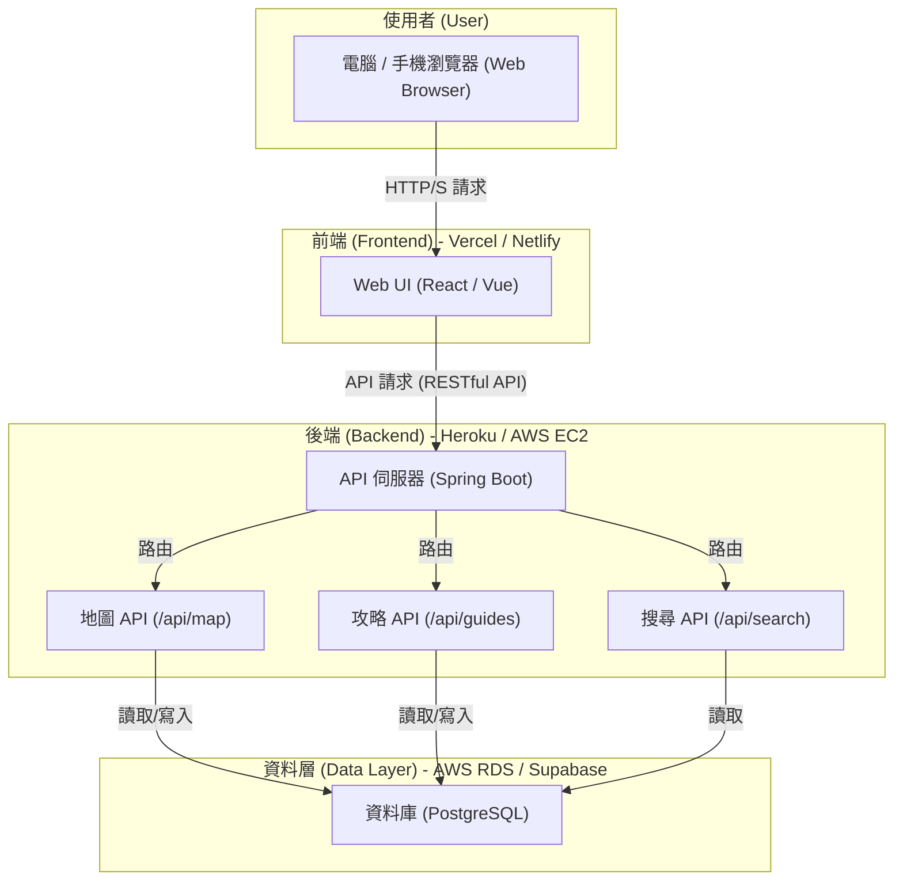

# 軟體設計文件 (Software Design Document)

## 1. 系統架構圖 / 시스템 아키텍처 다이어그램

## 2. 模組職責 / 모듈 책임

### 前端 (Frontend)
- **責任**: 提供使用者互動介面，是使用者體驗的核心。
- **主要功能**:
    - **互動地圖渲染**: 載入地圖圖磚 (Tiles)，並根據從後端獲取的資料繪製地標、路線、收集品等標記。
    - **使用者輸入處理**: 處理地圖的縮放、平移、點擊，以及篩選器和搜尋框的輸入。
    - **攻略內容顯示**: 將從後端獲取的攻略資料（Markdown 或 HTML）渲染成易於閱讀的圖文頁面。
    - **API 串接**: 向後端 API 發送請求以獲取或更新資料。
    - **響應式設計 (RWD)**: 確保網站在不同尺寸的裝置（電腦、平板、手機）上都有良好的瀏覽體驗。

### 後端 (Backend)
- **責任**: 作為前端與資料庫之間的中介，處理業務邏輯與資料存取。
- **主要功能**:
    - **Map API**:
        - 提供地圖標記資料，可根據類型（如 `collectible`, `landmark`）進行篩選。
        - 未來可提供地圖圖磚服務或與第三方服務整合。
    - **Guide API**:
        - 提供主線、支線、全收集等攻略的圖文內容。
        - 支援根據 ID 查詢特定攻略或特定收集品。
    - **Search API**:
        - 提供關鍵字搜尋功能，範圍涵蓋地標、區域名稱、收集品名稱等。
        - 執行資料庫查詢並回傳相關結果。
    - **安全性**: 處理 API 請求的驗證，防止惡意查詢（如 SQL Injection、XSS）。

### 資料層 (Data Layer)
- **責任**: 持久化儲存所有攻略網站需要的核心資料。
- **主要功能**:
    - **資料儲存**: 儲存地圖、地標、收集品、攻略文章等結構化資料。
    - **資料完整性**: 透過主鍵 (Primary Key)、外鍵 (Foreign Key) 等約束確保資料之間關聯的正確性。
    - **資料備份與恢復**: 制定備份策略，確保資料安全。
    - **查詢效能**: 針對常用查詢欄位建立索引 (Index)，以提升查詢速度。

## 3. 資料表對應 / 데이터베이스 테이블 매핑

以下是基於 PostgreSQL 的初步資料表設計。

### `map_areas` (地圖區域)
儲存遊戲中的主要區域或大陸。
| 欄位名稱 | 資料類型 | 描述 |
| :--- | :--- | :--- |
| `id` | `SERIAL PRIMARY KEY` | 區域的唯一識別碼 |
| `name` | `VARCHAR(100)` | 區域名稱 (例如：「雪山之巔」) |
| `description` | `TEXT` | 區域的簡短描述 |

### `markers` (地圖標記)
儲存所有顯示在地圖上的點。
| 欄位名稱 | 資料類型 | 描述 |
| :--- | :--- | :--- |
| `id` | `SERIAL PRIMARY KEY` | 標記的唯一識別碼 |
| `map_area_id` | `INTEGER` | 外鍵，關聯到 `map_areas.id` |
| `name` | `VARCHAR(100)` | 標記名稱 (例如：「古老的神廟」) |
| `description` | `TEXT` | 標記的詳細描述 |
| `type` | `VARCHAR(50)` | 標記類型 (如 `collectible`, `landmark`, `rest_point`) |
| `latitude` | `DECIMAL(9, 6)` | 緯度座標 |
| `longitude`| `DECIMAL(9, 6)` | 經度座標 |

### `collectibles` (收集品)
儲存特定類型的標記——收集品的詳細資訊。
| 欄位名稱 | 資料類型 | 描述 |
| :--- | :--- | :--- |
| `id` | `SERIAL PRIMARY KEY` | 收集品的唯一識別碼 |
| `marker_id` | `INTEGER` | 外鍵，關聯到 `markers.id` |
| `collectible_type`| `VARCHAR(50)` | 收集品類型 (如 `feather`, `flag`, `letter`) |
| `image_url` | `VARCHAR(255)` | 收集品外觀的圖片連結 |

### `guides` (攻略文章)
儲存攻略的主體內容。
| 欄位名稱 | 資料類型 | 描述 |
| :--- | :--- | :--- |
| `id` | `SERIAL PRIMARY KEY` | 攻略的唯一識別碼 |
| `title` | `VARCHAR(255)` | 攻略標題 (例如：「主線登頂最速路線」) |
| `guide_type`| `VARCHAR(50)` | 攻略類型 (如 `main_quest`, `side_quest`, `collection`) |
| `content` | `TEXT` | 攻略的完整內容 (支援 Markdown) |
| `author` | `VARCHAR(100)` | 作者名稱 |
| `created_at`| `TIMESTAMP` | 建立時間 |

### `guide_steps` (攻略步驟)
將一篇攻略拆解成多個步驟，每個步驟可以關聯一個地圖標記。
| 欄位名稱 | 資料類型 | 描述 |
| :--- | :--- | :--- |
| `id` | `SERIAL PRIMARY KEY` | 步驟的唯一識別碼 |
| `guide_id` | `INTEGER` | 外鍵，關聯到 `guides.id` |
| `step_number`| `INTEGER` | 步驟順序 |
| `description` | `TEXT` | 該步驟的詳細描述 |
| `image_url` | `VARCHAR(255)` | 輔助說明的圖片連結 (可選) |
| `marker_id` | `INTEGER` | 關聯的地圖標記 (可選) |

---

## 4. 設計細節問答 / Design Details Q&A / 디자인 상세 Q&A

#### Q1: 系統前台使用HTML，系統後台使用Spring Boot，或是沒有後台？ (시스템 프런트엔드는 HTML을 사용합니다. 시스템 백엔드는 Spring Boot를 사용하나요, 아니면 백엔드가 없나요?)
**A:**
*   **前台 (Frontend)**: 前台不僅僅是靜態 HTML，而是使用現代 JavaScript 框架（如 React 或 Vue）來建立的動態單頁應用 (SPA)。這些框架最終會生成 HTML，但它們提供了更豐富的互動能力。
*   **後台 (Backend)**: 是的，本系統有後台。根據架構圖，後台是使用 **Spring Boot** 框架開發的 API 伺服器，它扮演著連接前端與資料庫的橋樑角色。

#### Q2: 哪些資料應該由使用者輸入？哪些可以自動產生？ (어떤 데이터가 사용자로부터 입력되어야 하나요? 어떤 데이터는 자동으로 생성될 수 있나요?)
**A:**
*   **由使用者 (玩家) 輸入**:
    *   搜尋框中的「關鍵字」。
    *   篩選器中的「勾選選項」。
    *   地圖上的「互動操作」（縮放、平移）。
*   **由管理者 (攻略作者) 輸入**:
    *   所有核心內容，包括：地圖標記的座標與描述、攻略文章的標題與內容、收集品的圖片與位置等。
*   **由系統自動產生**:
    *   資料庫中每筆資料的唯一 `id`。
    *   資料建立或更新時的 `created_at` / `updated_at` 時間戳。

#### Q3: 前台顯示哪些資料？後台又要提供哪些支援？ (프런트엔드에는 어떤 데이터가 표시되나요? 백엔드는 어떤 지원을 제공해야 하나요?)
**A:**
*   **前台顯示**:
    *   互動地圖本身 (圖磚)。
    *   地圖上的所有標記 (地標、收集品、任務點)。
    *   攻略文章的圖文內容。
    *   搜尋結果列表。
    *   所有 UI 元素 (按鈕、選單、篩選器)。
*   **後台支援**:
    *   提供穩定且 RESTful 風格的 API 端點 (Endpoints)，讓前台能查詢 (GET) 上述所有資料。
    *   處理前台傳來的篩選和搜尋參數，並回傳正確的資料子集。
    -   確保資料庫連線的安全性與效能。

#### Q4: 如果要讓 API 更簡潔，要怎麼重新命名？ (API를 더 간결하게 만들려면 어떻게 이름을 변경해야 하나요?)
**A:** 目前的 API 設計可以更符合 RESTful 的資源導向原則，使其更簡潔直觀。
*   **原設計**:
    *   `/api/map/markers`
    *   `/api/guides/main`
    *   `/api/guides/collectibles`
*   **建議優化**:
    *   `GET /api/markers`: 獲取所有地圖標記。可搭配查詢參數 `?type=collectible` 來篩選。 (取代 `/api/map/markers`)
    *   `GET /api/guides`: 獲取所有攻略文章。可搭配 `?type=main_quest` 或 `?type=collection` 來篩選。(取代 `/api/guides/main` 和 `/api/guides/collectibles`)
    *   `GET /api/guides/{id}`: 獲取 ID 為 `{id}` 的單篇攻略。
    *   `GET /api/search?q={keyword}`: 保持不變，這是通用作法。

這個改變讓 API 更專注於「資源」(Markers, Guides)，而不是「動作」或「頁面」。

#### Q5: 這個設計有沒有考慮未來可能的擴充？ (이 디자인은 미래의 확장 가능성을 고려했나요?)
**A:** 是的，有。
*   **架構擴充性**: 三層式架構 (前端、後端、資料庫) 本身就是為了擴充而設計的。如果未來流量變大，可以獨立地為某一層增加更多伺服器資源。
*   **功能擴充性**:
    *   **資料庫**: `markers` 和 `guides` 表中的 `type` 欄位讓新增內容類型變得容易（例如：未來遊戲新增了「釣魚點」，只需增加一個新的 `type` 即可，不需改動資料表結構）。
    *   **API**: 新增功能時，只需增加新的 API 端點，不會影響舊有功能。例如，未來要增加「使用者評論」功能，可以新增一個 `/api/guides/{id}/comments` 的端點。
    *   **模組化**: 前後端分離的設計讓團隊可以分工，一組人專注優化前端 UI，另一組人擴充後端功能，互不干擾。