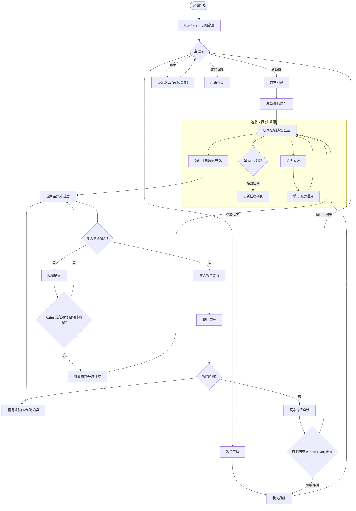

```mermaid
graph TD
    Start([遊戲開始]) --> Logo[顯示 Logo / 開頭動畫]
    Logo --> MainMenu{主選單}

    MainMenu -->|新遊戲| CreateChar[角色創建]
    CreateChar --> Tutorial[教學關卡/序章]
    Tutorial --> GameWorldLoop

    MainMenu -->|讀取進度| SelectSave[選擇存檔]
    SelectSave --> LoadGame[載入遊戲]
    LoadGame --> GameWorldLoop

    MainMenu -->|設定| Settings["設定選單 (音效/畫面)"]
    Settings --> MainMenu

    MainMenu -->|離開遊戲| End[結束程式]

    subgraph GameWorld ["遊戲世界 (主循環)"]
        GameWorldLoop[玩家在城鎮/安全區]
        GameWorldLoop --> TalkToNPC{與 NPC 對話}
        TalkToNPC -->|接到任務| UpdateQuests[更新任務列表]
        GameWorldLoop --> Shop[進入商店]
        Shop --> BuySell[購買/販賣道具]
        BuySell --> GameWorldLoop
        GameWorldLoop --> GoToWild[前往世界地圖/野外]
    end

    GoToWild --> InWild[玩家在野外/迷宮]
    InWild --> Encounter{是否遭遇敵人?}

    Encounter -->|是| Battle[進入戰鬥畫面]
    Battle --> BattleFlow[戰鬥流程]
    BattleFlow --> Victory{戰鬥勝利?}
    Victory -->|是| Rewards[獲得經驗值/金錢/道具]
    Rewards --> InWild
    Victory -->|否| PartyWiped[玩家隊伍全滅]
    PartyWiped --> GameOver{"遊戲結束 (Game Over) 畫面"}
    GameOver -->|讀取存檔| LoadGame
    GameOver -->|返回主選單| MainMenu

    Encounter -->|否| Explore[繼續探索]
    Explore --> DestinationReached{是否到達任務地點/關卡終點?}
    DestinationReached -->|是| TriggerEvent[觸發劇情/完成任務]
    TriggerEvent --> GameWorldLoop
    DestinationReached -->|否| InWild
```